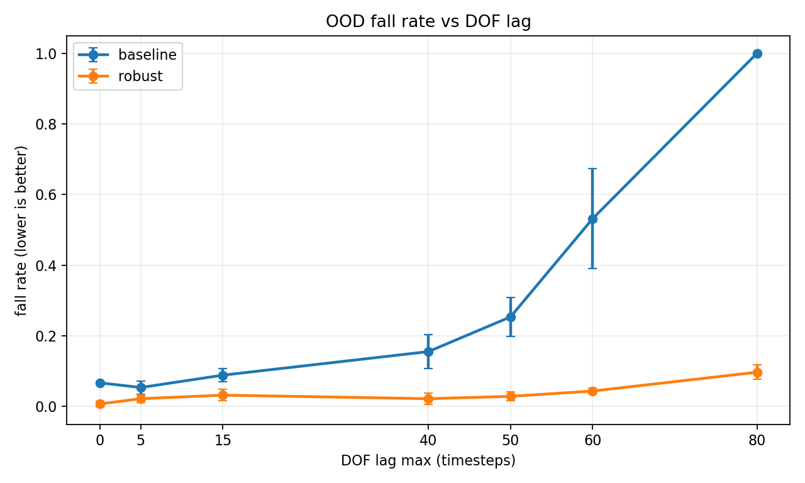
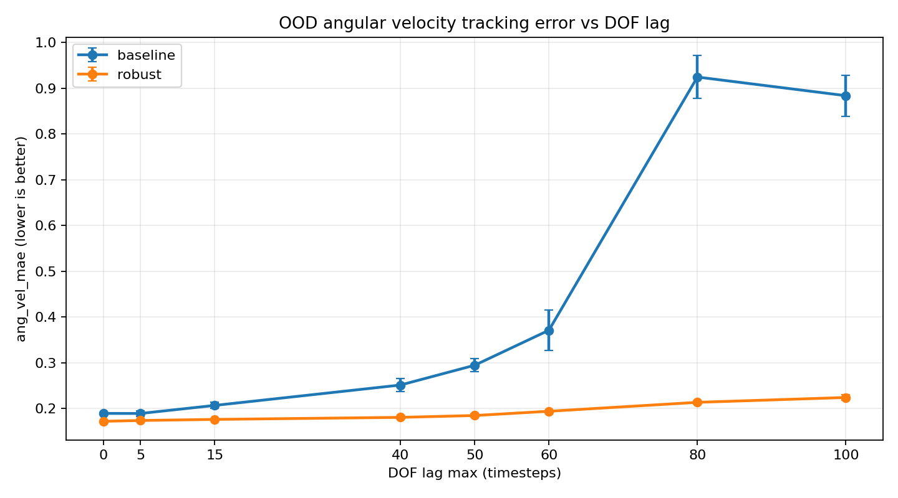
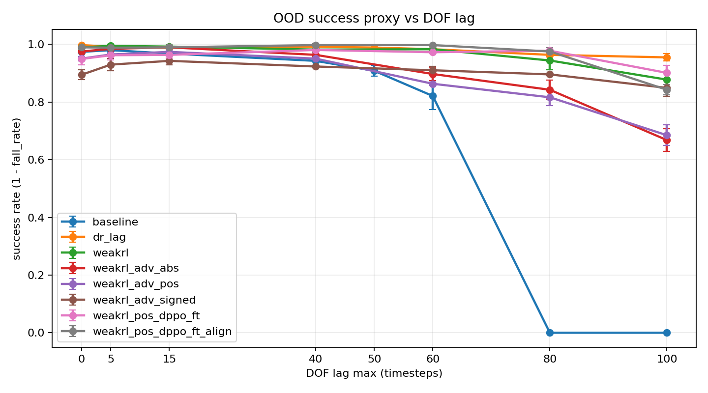
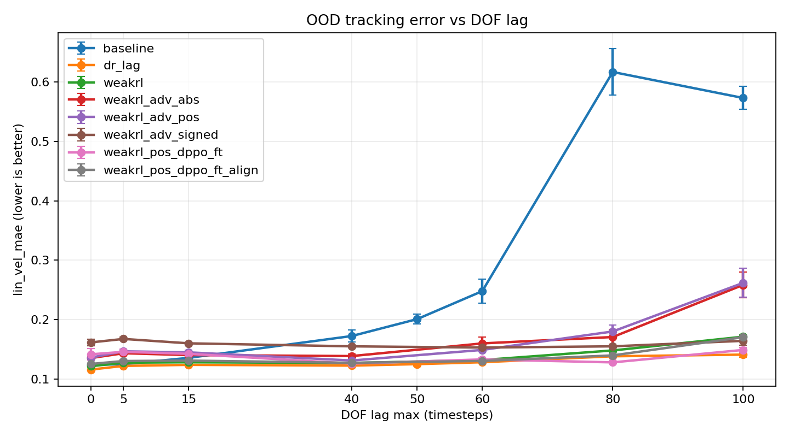
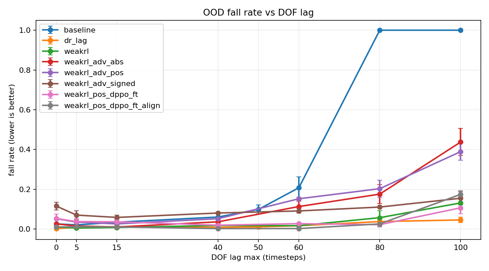
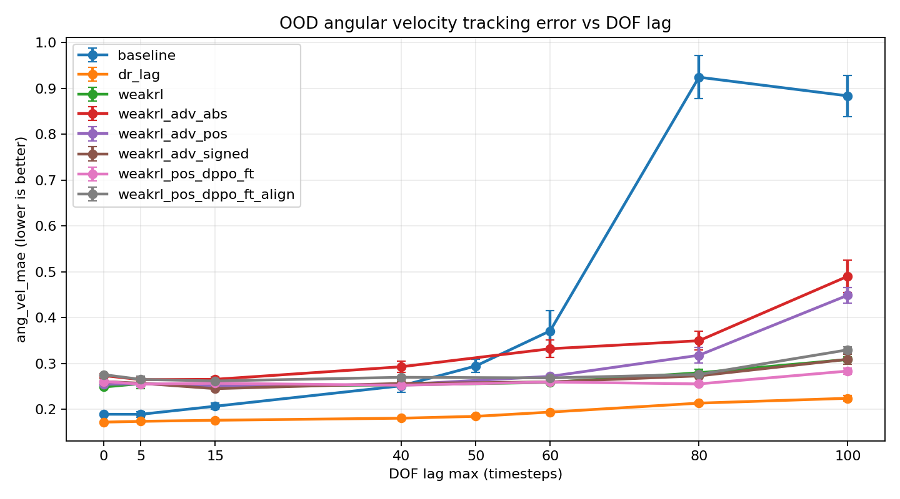

English | [中文](README.zh_CN.md)

## What this repository is

Fork of the **AgiBot X1** `x1_dh_stand` RL stack (Isaac Gym, dual-history actor–critic `ActorCriticDH`, runner `DHOnPolicyRunner`). On top of upstream training and export scripts, this repo adds:

1. **DOF actuator lag** — domain randomization during training and **OOD lag sweeps** in eval (e.g. lag 0–80+), with CSV/plot pipelines under `results/` and `scripts/`.
2. **Optional horizon-1 diffusion prior** — loaded from `diffusion_policy-main` checkpoints; used as **regularizer / teacher** in `DHPPO` and optionally as a **mixed behavioral policy** during rollout (see below).
3. **Docs** — [`docs/ONEPAGE_INTRO.md`](docs/ONEPAGE_INTRO.md) (overview), [`docs/DIFFUSION_HEAVY_RECIPE.md`](docs/DIFFUSION_HEAVY_RECIPE.md) (aggressive-but-runnable hyperparameters).

**Positioning:** the main learner is still **Gaussian PPO** (`humanoid/algo/ppo/dh_ppo.py`). Diffusion is **not** a full closed-form DPPO likelihood; see the one-pager for the exact scope.

---

## Diffusion (summary)

| Role | What happens |
|------|----------------|
| **Prior (update phase)** | Denoise loss on policy mean **μ** vs short obs (`diffusion_reg_coef`, optional advantage weighting). **Actor–diffusion align:** `MSE(μ, predict_action)` with no grad through sampling (`diffusion_actor_align_coef`). Optional **UNet finetune** via separate Adam. |
| **Behavior (rollout phase)** | With probability `diffusion_rollout_prob`, execute **`predict_action`** instead of Gaussian sample; buffer stores `rollout_from_diffusion`. PPO still uses **Gaussian** `log π(a|s)`; `diffusion_rollout_ppo_surrogate_scale` down-weights surrogate/entropy on diffusion rows. Optional **`diffusion_rollout_denoise_coef`** (with finetune): advantage-weighted denoise on **executed** diffusion actions. |

**Config:** `humanoid/envs/x1/x1_dh_stand_config.py` → `class algorithm` (`use_diffusion_reg`, paths, coefs, rollout flags). Loading requires a valid **`diffusion_prior_ckpt_path`** and compatible **`diffusion_policy-main`** on `PYTHONPATH` / hard-coded root in `dh_ppo.py`.

---

## Results: DOF lag OOD

**Setup:** baseline training (`add_dof_lag=False`) vs domain-randomized robust training (`add_dof_lag=True`, lag sampled in `[0, 40]` timesteps); **eval** sweeps larger actuator lag (OOD) in Isaac Gym. Numeric tables: [`results/dof_lag_ood_report.md`](results/dof_lag_ood_report.md), narrative: [`results/project_narrative.md`](results/project_narrative.md).

### Baseline vs DR (core sweep)

| Success rate vs DOF lag | Velocity tracking (lin_vel MAE) |
|:---:|:---:|
|  |  |

| Fall rate | Angular velocity tracking MAE |
|:---:|:---:|
|  |  |

| Training curves (example runs) |
|:---:|
|  |

### Multi-run comparison (merged eval CSVs)

Scripts: [`scripts/plot_all_eval_runs.py`](scripts/plot_all_eval_runs.py), [`scripts/analyze_dof_lag_ood.py`](scripts/analyze_dof_lag_ood.py). Summary: [`results/dof_lag_ood_all_eval_report.md`](results/dof_lag_ood_all_eval_report.md).

| Success | Lin vel MAE |
|:---:|:---:|
|  |  |

| Fall rate | Ang vel MAE |
|:---:|:---:|
|  |  |

### Sim2sim (MuJoCo) demo (GIF)

**Baseline** policy (exported JIT) rolled out in MuJoCo via `humanoid/scripts/sim2sim.py`. Cross-simulator check; **quantitative OOD lag results remain from Isaac Gym eval above.**


**Reproduce plots / merge CSVs:** [`results/README.md`](results/README.md).

---

## Quick start

```bash
pip install -e .
PYTHONPATH=. python humanoid/scripts/train.py --task=x1_dh_stand --headless --num_envs=<N>
```

- **Install, play, export JIT/ONNX, sim2sim, joystick:** **[`docs/INSTALL_AGIBOT.md`](docs/INSTALL_AGIBOT.md)** (upstream AgiBot instructions; GIFs under `doc/`).
- **DOF lag eval / merge CSV / plots:** [`results/README.md`](results/README.md), `scripts/run_eval_dof_lag_ood.sh`, `scripts/analyze_dof_lag_ood.py`.

---

## Layout

```
humanoid/algo/ppo/dh_ppo.py      # DHPPO + diffusion hooks
humanoid/algo/ppo/actor_critic_dh.py
humanoid/algo/ppo/rollout_storage.py   # rollout_from_diffusion
humanoid/envs/x1/x1_dh_stand_config.py # task + algorithm hyperparameters
docs/                            # ONEPAGE_INTRO, DIFFUSION_HEAVY_RECIPE, INSTALL_AGIBOT*
results/, scripts/               # lag OOD figures and eval helpers
```

---

## Acknowledgements

Based on **AgiBot X1** open-source RL training code; extensions include DOF lag study, eval tooling, and optional **diffusion prior / mixed rollout** in `DHPPO`. Upstream references: [`docs/INSTALL_AGIBOT.md`](docs/INSTALL_AGIBOT.md) (Acknowledgements / References).
