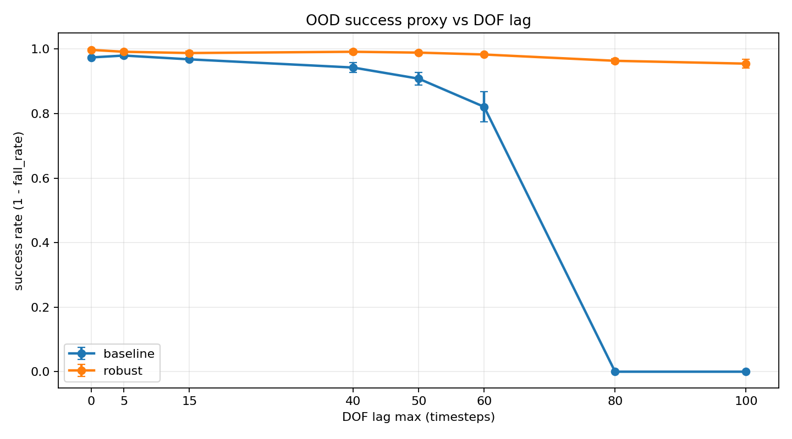
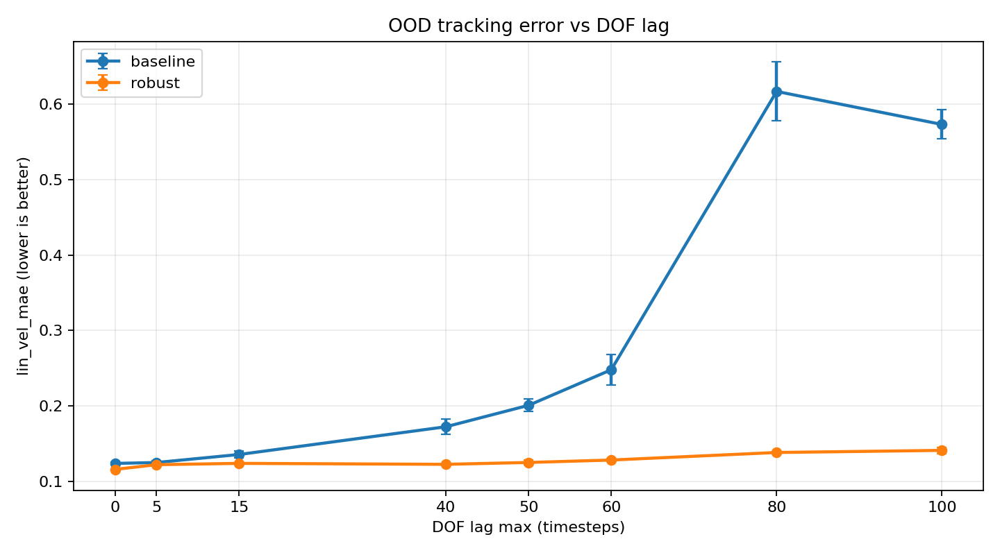
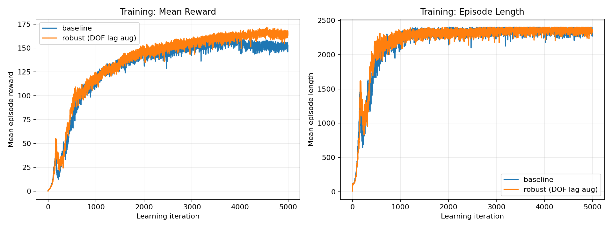
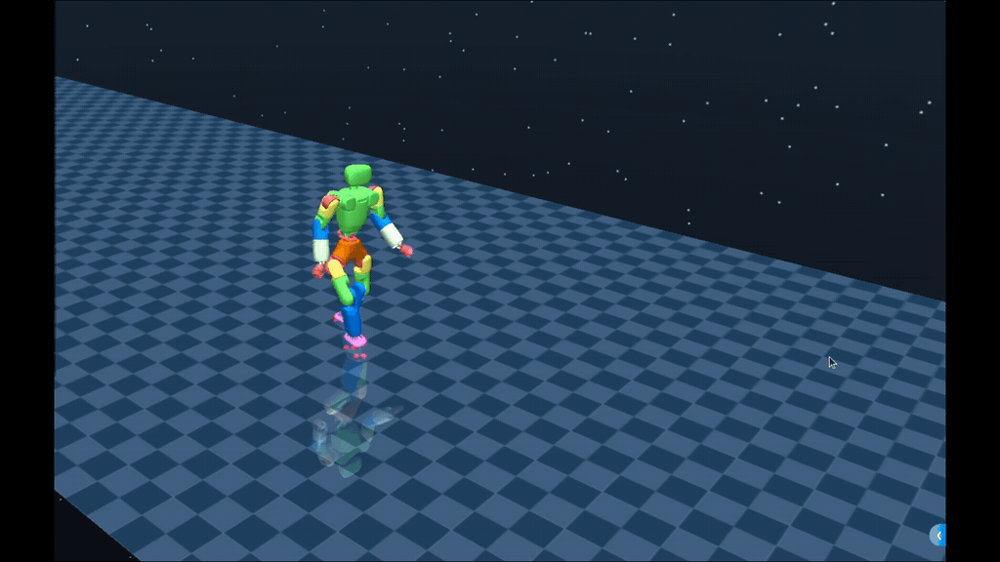
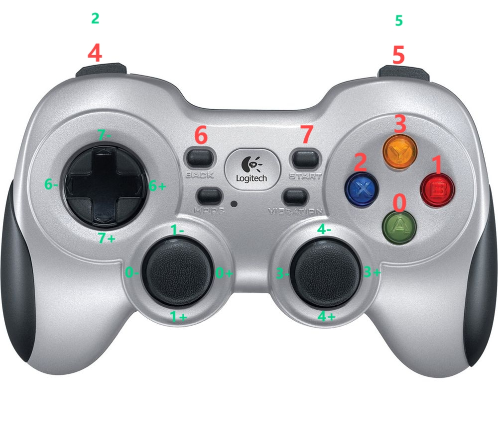

> **Archived:** Previous root README (DOF lag fork narrative + full AgiBot X1 install and usage). The current entry point is [`README.md`](README.md).

English | [中文](README.zh_CN.original.md)

## DOF lag robustness (this fork)

This repository extends the AgiBot X1 `x1_dh_stand` training stack with a **baseline vs DOF-lag domain randomization** study. We compare training **without** actuator lag (`add_dof_lag=False`) against training **with** random per-joint lag in `[0, 40]` timesteps, then evaluate **OOD** delays (e.g. up to 80 steps) in Isaac Gym.

**Takeaways (3 seeds):** at **lag=0**, the robust policy matches or improves on baseline success; at **lag=80**, baseline success drops to **0%** while the robust policy stays around **~90%**. See numeric tables in [`results/dof_lag_ood_report.md`](results/dof_lag_ood_report.md) and the one-pager [`results/project_narrative.md`](results/project_narrative.md).

| Success rate vs DOF lag | Velocity tracking error (lin_vel MAE) |
|:---:|:---:|
|  |  |

| Training curves (example runs) |
|:---:|
|  |

### Sim2sim (MuJoCo) demo (GIF)

Screen recording of a **baseline** policy (exported JIT) rolled out in MuJoCo via `humanoid/scripts/sim2sim.py`. This is **cross-simulator** validation; OOD lag metrics remain from Isaac Gym eval above.



**Reproduce analysis / plots:** commands are documented in [`results/README.md`](results/README.md) (merge CSVs, run `scripts/analyze_dof_lag_ood.py`).

---

## Introduction

[AgiBot X1](https://www.zhiyuan-robot.com/qzproduct/169.html) is a modular humanoid robot with high dof developed and open-sourced by AgiBot. It is built upon AgiBot's open-source framework `AimRT` as middleware and using reinforcement learning for locomotion control.

This project is about the reinforcement learning training code used by AgiBot X1. It can be used in conjunction with the [inference software](https://aimrt.org/) provided with AgiBot X1 for real-robot and simulated walking debugging, or be imported to other robot models for training.


## Start

### Install Dependencies
1. Create a new Python 3.8 virtual environment:
   - `conda create -n myenv python=3.8`.
2. Install pytorch 1.13 and cuda-11.7:
   - `conda install pytorch==1.13.1 torchvision==0.14.1 torchaudio==0.13.1 pytorch-cuda=11.7 -c pytorch -c nvidia`
3. Install numpy-1.23:
   - `conda install numpy=1.23`.
4. Install Isaac Gym:
   - Download and install Isaac Gym Preview 4 from https://developer.nvidia.com/isaac-gym.
   - `cd isaacgym/python && pip install -e .`
   - Run an example with `cd examples && python 1080_balls_of_solitude.py`.
   - Consult `isaacgym/docs/index.html` for troubleshooting.
5. Install the training code dependencies:
   - Clone this repository.
   - `pip install -e .`

### Usage

Run scripts from the **repository root**. Entry points live under `humanoid/scripts/`.

#### Train:
```bash
python humanoid/scripts/train.py --task=x1_dh_stand --run_name=<run_name> --headless
```
- The trained model will be saved under `logs/<experiment_name>/exported_data/<date_time><run_name>/model_<iteration>.pt`, where `<experiment_name>` is defined in the config file (default `x1_dh_stand`).


#### Play:
```bash
python humanoid/scripts/play.py --task=x1_dh_stand --load_run=<date_time><run_name>
```


#### Generate the JIT Model:
```bash
python humanoid/scripts/export_policy_dh.py --task=x1_dh_stand --load_run=<date_time><run_name>
```
- The JIT model will be saved under `logs/<experiment_name>/exported_policies/<date_time>/`.

#### Generate the ONNX Model:
```bash
python humanoid/scripts/export_onnx_dh.py --task=x1_dh_stand --load_run=<date_time>
```
- The ONNX model will be saved under `logs/<experiment_name>/exported_policies/<date_time>/`.

#### Parameter Descriptions:
- task: Task name
- resume: Resume training from a checkpoint
- experiment_name: Name of the experiment to run or load.
- run_name: Name of the run.
- load_run: Name of the run to load when resume=True. If -1: will load the last run.
- checkpoint: Saved model checkpoint number. If -1: will load the last checkpoint.
- num_envs: Number of environments to create.
- seed: Random seed.
- max_iterations: Maximum number of training iterations.

### Add New Environments
1. Create a new folder under the `envs/` directory, and then create a configuration file `<your_env>_config.py` and an environment file `<your_env>_env.py` in the folder. The two files should inherit `LeggedRobotCfg` and `LeggedRobot` respectively.

2. Place the URDF, mesh, and MJCF files of the new robot in the `resources/` folder.
- Configure the URDF path, PD gain, body name, default_joint_angles, experiment_name, etc., for the new robot in `<your_env>_config.py`.

3. Register the new robot in `humanoid/envs/__init__.py`.

### sim2sim
Use MuJoCo for sim2sim validation (after exporting JIT):
```bash
python humanoid/scripts/sim2sim.py --task=x1_dh_stand --load_model <folder_under_exported_policies>
```


### Usage of Joystick
We use the Logitech F710 Joystick. When starting `play.py` and `sim2sim.py`, press and hold button 4 while rotating the joystick to control the robot to move forward/backward, strafe left/right or rotate.

|         Button           |         Command         |
| -------------------- |:--------------------:|
|         4 + 1-        |         Move forward          |
|         4 + 1+        |         Move backward          |
|         4 + 0-        |        Strafe left         |
|         4 + 0+        |        Strafe right         |
|         4 + 3-        |       Rotate counterclockwise       |
|         4 + 3+        |       Rotate clockwise       |


## Directory Structure
```
.
|— humanoid           # Main code directory
|  |—algo             # Algorithm directory
|  |—envs             # Environment directory
|  |—scripts          # Script directory
|  |—utils             # Utility and function directory
|— logs               # Training outputs (gitignored; large)
|— resources          # Resource library
|  |— robots          # Robot urdf, mjcf, mesh
|— results            # DOF lag figures and summaries (this fork)
|— scripts            # Eval / analysis shell helpers (this fork)
|— README.md          # README document
```

## Acknowledgements

Training code is based on the **AgiBot X1** open-source RL stack. This fork adds **DOF lag experiments, eval scripts, and result figures** under `results/` and `scripts/` as documented above.

> References
> * [GitHub - leggedrobotics/legged_gym: Isaac Gym Environments for Legged Robots](https://github.com/leggedrobotics/legged_gym)
> * [GitHub - leggedrobotics/rsl_rl: Fast and simple implementation of RL algorithms, designed to run fully on GPU.](https://github.com/leggedrobotics/rsl_rl)
> * [GitHub - roboterax/humanoid-gym: Humanoid-Gym: Reinforcement Learning for Humanoid Robot with Zero-Shot Sim2Real Transfer https://arxiv.org/abs/2404.05695](https://github.com/roboterax/humanoid-gym)
